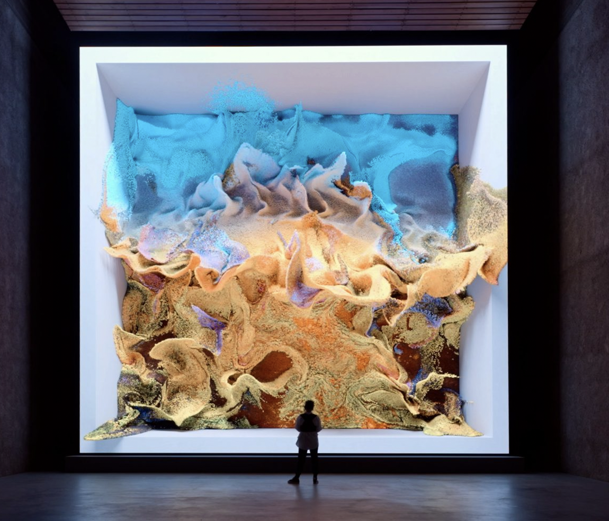
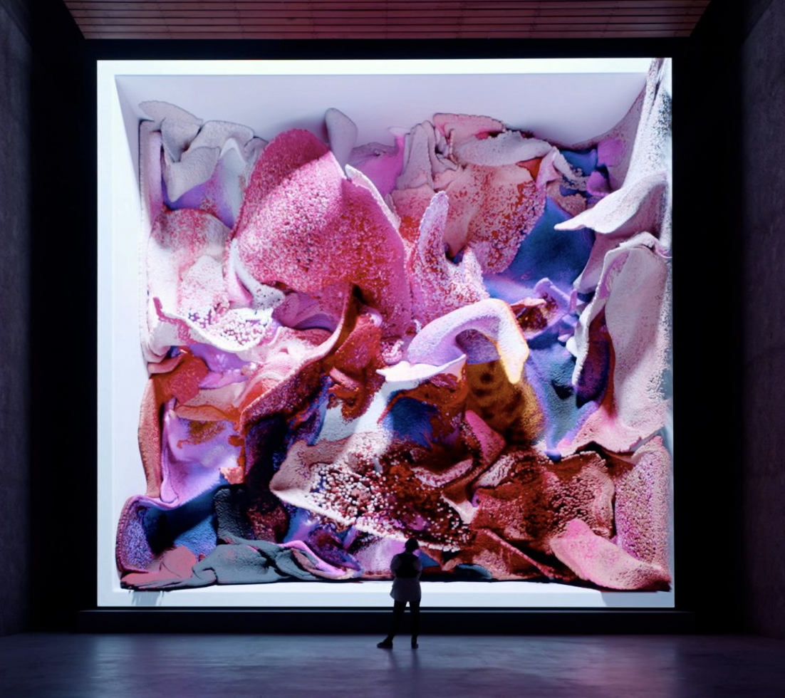
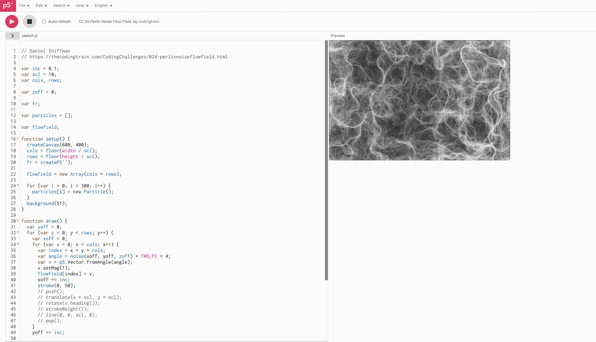

# Week 8 Quiz

## Part 1: Imaging Technique Inspiration

I'm inspired by Refik Anadol's Machine Hallucinations series. This is a visual style characterised by fluid, constantly morphing, abstract forms and colours that seem to drift and shift like a liquid dream. It appears as a dynamic, continuous flow of visual information, often derived from a vast photographic dataset of nature but transformed into otherworldly, non-representational imagery by Artificial Intelligence.

I will incorporate data transformation into "hallucinatory" fluid movements. This abstract, dynamic visual, specifically using the Perlin noise and randomness method required for the individual assignment task is ideal to represent the changing movement.

## Part 2: Coding Technique Exploration

A practical coding technique to achieve the fluid, non-linear movement and transformation seen in Anadol's work, is through Perlin Noise Flow Fields.

This technique, as explored in Daniel Shiffman's The Coding Train tutorials, uses the mathematically generated, naturally smooth random values of Perlin Noise to create a Flow Field. This field then directs the movement of particles or pixels. By continuously mapping a particle's direction based on the noise value at its location, you can simulate fluid motion reminiscent of smoke, water, or the continuous morphing of Anadol's visuals. 

[Code implementation link 1](https://thecodingtrain.com/challenges/24-perlin-noise-flow-field)
[Code implementation link 2](https://www.youtube.com/watch?v=1-QXuR-XX_s)

